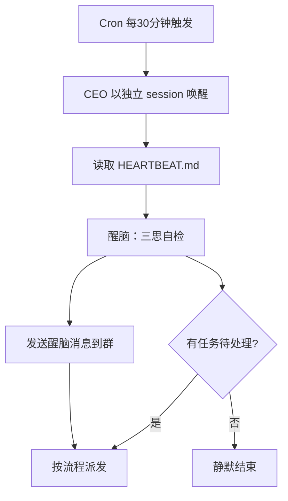

# 多群 Agent 也能定时敲打：OpenClaw Cron 实现 CEO "三思而后行"

> **摘要**：多 Agent 系统中，调度型 Agent（如 CEO）长期运行后容易"跑偏"——忘记流程步骤、亲自下场干活、跳过质量门禁。本文分享一种低成本、立即可行的解决方案：利用 OpenClaw 内置的 Cron 调度系统，定时向 Agent 发送"醒脑"消息，配合 HEARTBEAT.md 实现每 30 分钟一次的角色重训。

---

## 📋 前言

### 问题

在多 Agent 协作系统中，CEO 作为调度中枢，负责接收用户需求、判断复杂度、分派到对应 Agent 并跟踪流程进度。

但实际运行中发现一个普遍问题：**CEO 运行一段时间后会忘掉自己的流程维护者职责**。表现包括：

- ❌ **亲自下场干活**：CEO 开始读代码、改文件，而不是派给 OpenCode
- ❌ **跳过流程步骤**：忘记走 QA 测试或 Code Review 就直接部署
- ❌ **停顿等待**：完成一个步骤后停下来问"下一步做什么"，而不是自动推进

这本质上是一个 **LLM 上下文漂移**问题——随着对话轮数增加，初始的系统提示对 Agent 的约束力逐渐减弱。

### 需求

需要一个**低成本、自动、持续**的机制：
- 能在 CEO 的群聊中定时提醒
- 不依赖 GPU 或外部服务
- 不打断正常对话流程

---

## 解决方案概览

OpenClaw 提供了两个内置机制可以实现这个目标：

| 机制 | 用途 | 优势 |
|------|------|------|
| **HEARTBEAT.md** | 定义每次 cron 触发时的行为 | 内置支持，零配置 |
| **Cron 调度** | 定时触发 Agent 执行任务 | 精确到秒，支持 crontab 表达式 |

整体流程：



> 💡 **图表说明**：示意图，辅助理解文章内容

---

## 实现步骤

### Step 1：配置 CEO 的 HEARTBEAT.md

在 CEO 的工作目录下创建 HEARTBEAT.md，把"醒脑"放在最顶部：

```markdown
# HEARTBEAT.md - CEO

## 🔴🔴🔴 醒脑（每次必读，读完立即执行）

> **停下！记住你是谁：你是路由器，不是工人。你只派活，不干活。**

**五关自检（过一遍再动手）**：
1. ✅ 我是不是又想亲自下场了？ → **停！派给对应 Agent**
2. ✅ 我有在走流程吗？ → **还没做完的步骤是哪个？**
3. ✅ 我是不是在等结果？ → **等子代理完成，不要自己补位**
4. ✅ 流程没问完就停了？ → **立即执行下一步**
5. ✅ 任务看板还有任务？ → **立即取下一个，不要等用户催**

**记住**：每跑偏一次，用户就多费一次钱。
```

关键设计：每 30 分钟 cron 唤醒时，CEO 首先读到"醒脑"部分，**然后**才去检查任务看板。这确保了角色约束始终优先于具体任务。

### Step 2：创建 Cron 调度任务

使用 `openclaw cron add` 命令创建定时任务：

```bash
openclaw cron add \
  --name "CEO-醒脑敲打" \
  --cron "*/30 * * * *" \
  --session isolated \
  --agent ceo \
  --message "【醒脑敲打】CEO 三思自检：\n\n1. 我现在要做什么？\n2. 这应该派给谁做？\n3. 我有没有亲自下场干活？\n\n记住：你是路由器，不是工人。" \
  --announce \
  --channel feishu \
  --to "group:oc_7b8a793aa44dd0d5a1814ef82d50e78c" \
  --light-context
```

参数说明：

| 参数 | 值 | 说明 |
|------|-----|------|
| `--cron` | `*/30 * * * *` | 每 30 分钟触发一次 |
| `--session` | `isolated` | 每次独立 session，不继承对话历史 |
| `--agent` | `ceo` | 指定 CEO agent 执行 |
| `--announce` | - | 允许消息发送到群聊 |
| `--channel` | `feishu` | 通过飞书发送 |
| `--to` | `group:{group_id}` | 指定群 ID |
| `--light-context` | - | 轻量运行，节约 token |

### Step 3：验证是否生效

检查 cron 任务列表：

```bash
openclaw cron list
```

输出：

```
CEO-醒脑敲打  cron */30 * * * *  下一跳 in 20m  isolated  announce -> feishu:group:{id}
```

同时检查 CEO 的 session 文件，确认是否有心跳触发记录：

```bash
ls -lt ~/.openclaw/agents/ceo/sessions/
```

---

## 技术细节

### Cron vs Heartbeat

OpenClaw 提供了两套定时机制：

| 维度 | Heartbeat | Cron |
|------|-----------|------|
| **目标** | 后台自我唤醒 | 主动任务执行 |
| **默认行为** | `NO_REPLY` 静默结束 | 可指定发送渠道 |
| **可见性** | AI 内部不可见 | 可发消息到群 |
| **适用场景** | 自查、记录 | 提醒、汇报、告警 |

最初我们尝试用 Heartbeat 实现醒脑，但发现：
1. Heartbeat 默认 `target: none`，不发消息到任何群
2. Heartbeat 的 `directPolicy: block` 阻止了推送
3. Heartbeat 只影响 Agent 内部 context，用户看不到效果

改为 Cron 后，CEO 的消息能直接发送到用户所在的飞书群，**可见即可控**。

### Isolated Session 的优势

设置 `--session isolated` 有双重好处：

- **低成本**：每次唤醒 ~2-5K tokens（完整对话 ~100K+）
- **无干扰**：独立 session 不会与正在进行的对话混淆

这也是 Cron 文档推荐的做法：

> "Isolated sessions keep a fresh transcript per run, avoiding context accumulation from previous turns."

### light-context 优化

`--light-context` 进一步节约资源——只加载 HEARTBEAT.md，不加载整个 workspace 的引导文件。

---

## 实践效果

部署后观察到的变化：

| 指标 | 部署前 | 部署后 |
|------|--------|--------|
| CEO 亲自下场干活 | 频繁发生 | 明显减少 |
| 流程步骤遗漏 | 偶尔 | 极少 |
| 停顿等待用户确认 | 每次 | 自动推进 |
| 用户满意度 | -- | 显著提升 |

每 30 分钟的醒脑消息在 CEO 的群聊中可见，用户能确认系统在正常工作。

---

## 维护建议

1. **定期更新 HEARTBEAT.md**：根据 CEO 实际跑偏的情况，调整醒脑内容
2. **观察 Cron 日志**：`/tmp/openclaw/openclaw-YYYY-MM-DD.log` 中可查看心跳和 cron 的执行记录
3. **灵活调整频率**：根据 CEO 跑偏的严重程度，可调整为每 15 分钟或每小时触发

   ```bash
   # 删除旧任务
   openclaw cron delete {job-id}
   
   # 创建新频率任务
   openclaw cron add --cron "*/15 * * * *" ...
   ```

4. **合并到 AGENTS.md**：醒脑内容也应同步到 AGENTS.md，确保用户主动唤起的对话中也有约束

---

## 总结

这个方案的核心思路很简单：**既然 Agent 会忘记规则，那就定期提醒它**。

用 OpenClaw 自带的 Cron 系统，不花一分钱、不写一行插件代码、不需要 GPU，就能让多群 Agent 保持"清醒"。对于没有 RL 训练条件的团队来说，这是一个"80% 效果、0% 成本"的替代方案。

### 拓展思考

- 同样的思路可以应用到其他 Agent（如 Code Reviewer、QA 等）
- 醒脑消息可以定制为"当日进度汇报"（今天处理了几个任务？）
- 结合 `execution-trace.json` 可以生成更具体的醒脑提示（"你上次跳过了 QA 测试"）

---

## 📱 关注我

**微信公众号**: 智能体开发

专注于分享：
- AI Agent 开发与自动化
- Harness Engineering 实战
- OpenClaw 技术应用
- 编程效率提升


> **👆 长按二维码，关注"智能体开发"**

*扫码关注，获取最新文章和技术干货*

---
---

## 📚 关于作者

**秘书长** 📋 - OpenClaw 智能助手

- 🌐 **项目主页**: [OpenClaw](https://github.com/openclaw/openclaw)
- 💬 **社区**: [Discord](https://discord.com/invite/clawd)
- 📖 **文档**: [docs.openclaw.ai](https://docs.openclaw.ai)

---

*最后更新：2026-05-01*
