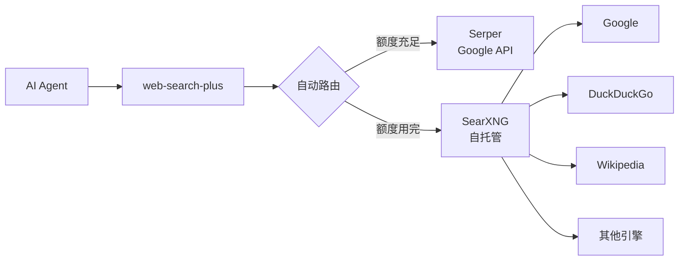
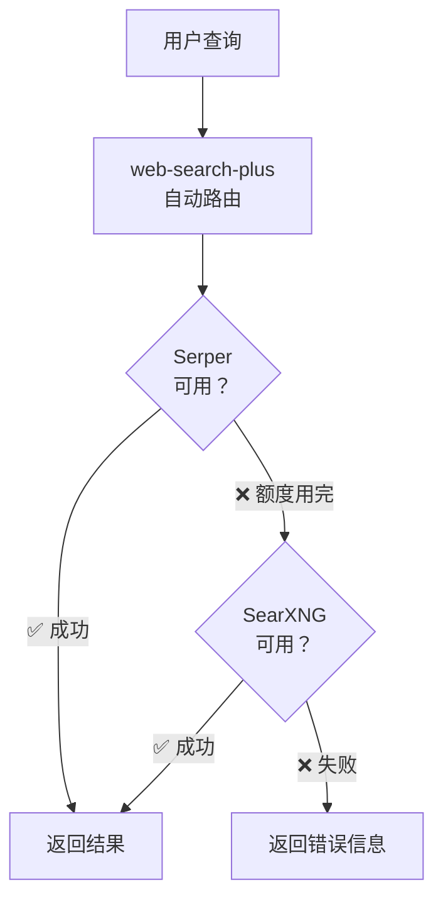

# AI Agent 搜索 API 额度用完怎么办？——用 web-search-plus + SearXNG 自托管实现零成本无限量搜索

> **摘要**：AI Agent 依赖搜索 API（Tavily、Serper）获取实时信息，但免费额度有限（Tavily 1000次/月，Serper 2500次/月）。本文分享一套"多提供商自动路由 + 自托管兜底"的解决方案：用 web-search-plus 做智能搜索路由，用 SearXNG Docker 自托管做无限量兜底，最终实现搜索能力永不断粮。

---

## 📋 前言

在构建 AI Agent 系统的过程中，搜索能力是 Agent 的"眼睛"。无论是 deep-research-pro 的深度调研，还是日常的信息检索，都离不开搜索 API。

然而，一个尴尬的现实是：**所有搜索 API 都有免费额度限制**。

| 搜索 API | 免费额度 | 超出后 |
|----------|----------|--------|
| Tavily | 1,000 次/月 | ❌ 直接报错 |
| Serper (Google) | 2,500 次/月 | ❌ 拒绝服务 |
| Exa | 1,000 次/月 | ❌ 需要付费 |
| You.com | 有限免费 | ❌ 额度很小 |

当这些 API 额度用完时，AI Agent 就变成了"瞎子"——无法搜索最新信息，只能依赖训练数据中的过时知识。

本文分享一个实战方案，用 **web-search-plus + SearXNG 自托管** 构建一套零成本、无限量的搜索链路。

---

## 一、破局思路：多提供商路由 + 自托管兜底

### 1.1 核心架构



### 1.2 故障转移机制

web-search-plus 内置了**自动故障转移**机制：

1. 查询到达时，自动分析意图，选择最合适的提供商
2. 如果首选提供商失败（额度用完、网络超时等），自动尝试下一个
3. 按优先级依次尝试，直到返回结果



**优先级配置**：
```
Serper (2500次/月免费) → SearXNG (自托管，无限量)
```

日常用 Serper 享受 Google 搜索质量，额度用完自动切到 SearXNG 兜底，完全无感。

---

## 二、实战步骤

### Step 1: 安装 web-search-plus

```bash
# web-search-plus 已安装在 OpenClaw skills 目录下
ls ~/.openclaw/skills/web-search-plus/

# 查看支持的所有提供商
cat ~/.openclaw/skills/web-search-plus/SKILL.md | grep "Provider"
```

web-search-plus 支持 6 个搜索提供商：Serper、Tavily、Exa、Perplexity、You.com、SearXNG，全部通过统一接口调用。

### Step 2: 注册 Serper 免费 Key

访问 [serper.dev](https://serper.dev) 注册账号，免费获得 2,500 次/月的 Google 搜索额度。

```bash
# 将 API Key 写入环境变量
export SERPER_API_KEY="your-serper-api-key"

# 配置 web-search-plus
cd ~/.openclaw/skills/web-search-plus
python3 scripts/setup.py
```

或者直接写入配置文件：

```json
{
  "serper": {
    "api_key": "your-serper-api-key",
    "country": "cn",
    "language": "zh-cn"
  },
  "defaults": {
    "provider": "serper",
    "max_results": 5
  }
}
```

验证搜索是否正常：

```bash
cd ~/.openclaw/skills/web-search-plus
python3 scripts/search.py -q "AI Agent 2026" -n 3
```

### Step 3: Docker 部署 SearXNG（5 分钟）

SearXNG 是一个开源的元搜索引擎，聚合 Google、DuckDuckGo、Wikipedia 等多个引擎的结果，**完全免费，无限量**。

```bash
# 启动 SearXNG 容器
docker run -d \
  --name searxng \
  --restart unless-stopped \
  -p 8888:8080 \
  -e SEARXNG_BASE_URL=http://localhost:8888 \
  searxng/searxng:latest
```

### Step 4: 开启 JSON API

SearXNG 默认只返回 HTML 页面，AI Agent 需要 JSON 格式。需要修改配置文件开启 JSON API：

```bash
# 从容器中复制默认配置文件
docker cp searxng:/etc/searxng/settings.yml ./settings.yml

# 修改 formats 配置，加入 json
# 找到 search → formats 部分，改为：
sed -i 's/formats: \[html\]/formats: [html, json]/' settings.yml

# 将修改后的配置挂载回容器
docker rm -f searxng
docker run -d \
  --name searxng \
  --restart unless-stopped \
  -p 8888:8080 \
  -v $(pwd)/settings.yml:/etc/searxng/settings.yml:ro \
  -e SEARXNG_BASE_URL=http://localhost:8888 \
  searxng/searxng:latest
```

验证 JSON API：

```bash
curl -s "http://localhost:8888/search?q=test&format=json" | python3 -m json.tool | head -20
```

正常返回 JSON 格式的搜索结果，包含标题、URL、摘要、引擎来源等信息。

### Step 5: 配置自动故障转移

将 Serper 和 SearXNG 都配入 web-search-plus，设置优先级：

```json
{
  "serper": {
    "api_key": "your-serper-api-key",
    "country": "cn",
    "language": "zh-cn"
  },
  "searxng": {
    "instance_url": "http://localhost:8888"
  },
  "defaults": {
    "provider": "serper",
    "max_results": 5
  },
  "auto_routing": {
    "enabled": true,
    "fallback_provider": "searxng",
    "provider_priority": ["serper", "searxng"],
    "disabled_providers": ["tavily", "exa", "you"],
    "confidence_threshold": 0.3
  }
}
```

**关键配置项说明**：

| 配置项 | 说明 |
|--------|------|
| `fallback_provider` | 所有提供商都失败时的最终兜底 |
| `provider_priority` | 按优先级尝试的提供商列表 |
| `disabled_providers` | 禁用的提供商（额度已用完或未配置） |
| `confidence_threshold` | 自动路由的置信度阈值 |

### Step 6: 处理 SSRF 保护

web-search-plus 有 SSRF 保护机制，会阻止对内网地址的请求。SearXNG 跑在 `localhost:8888`，属于内网地址，需要放行：

```bash
# 设置环境变量绕过 SSRF 保护
export SEARXNG_ALLOW_PRIVATE=1
```

建议写入 shell 配置文件永久生效：

```bash
echo 'export SEARXNG_ALLOW_PRIVATE=1' >> ~/.bashrc_env
```

---

## 三、测试验证

### 3.1 测试 Serper 搜索

```bash
cd ~/.openclaw/skills/web-search-plus
python3 scripts/search.py -q "AI Agent 发展趋势 2026" -n 3
```

返回结果会显示 `"provider": "serper"`。

### 3.2 测试 SearXNG 搜索

```bash
SEARXNG_ALLOW_PRIVATE=1 python3 scripts/search.py -q "AI Agent 发展趋势 2026" -n 3 -p searxng
```

返回结果会显示 `"provider": "searxng"`。

### 3.3 测试自动故障转移

禁用 Serper（模拟额度用完），验证自动切到 SearXNG：

```json
// 临时修改 config.json，禁用 serper
"disabled_providers": ["serper", "tavily", "exa", "you"]
```

```bash
SEARXNG_ALLOW_PRIVATE=1 python3 scripts/search.py -q "AI Agent" -n 3
```

输出显示：

```json
{
  "fallback": true,
  "failed_provider": "serper",
  "trying_next": "searxng",
  "provider": "searxng",
  ...
}
```

故障转移成功 ✅

---

## 四、集成到 deep-research-pro

有了这套搜索链路后，可以改造 deep-research-pro 的搜索命令：

### 改造前

```bash
# 依赖单个搜索源，额度用完就挂
~/.openclaw/skills/ddg-search/scripts/ddg "<query>" --max 8
```

### 改造后

```bash
# 多提供商自动路由，永不中断
python3 ~/.openclaw/skills/web-search-plus/scripts/search.py -q "<query>" -n 8
```

将 deep-research-pro 的 SKILL.md 中所有搜索命令替换为 web-search-plus 调用，即可享受自动故障转移带来的稳定性。

---

## 五、效果对比

| 维度 | 改造前 | 改造后 |
|------|--------|--------|
| 搜索源 | 单源（DuckDuckGo） | 多源（Serper + SearXNG + ...） |
| 额度限制 | ❌ 受限于 API 额度 | ✅ 近乎无限 |
| 故障转移 | ❌ 无 | ✅ 自动 fallback |
| 搜索质量 | 一般 | Google 级别（Serper）+ 多引擎聚合（SearXNG） |
| 部署成本 | $0（但有限额） | $0（无限量） |
| 维护成本 | 低 | 低（Docker 守护即可） |

---

## 六、总结

这套方案的核心价值在于：

1. **零成本** — Serper 免费 2500次/月 + SearXNG 自托管完全免费
2. **无限量** — SearXNG 聚合多个搜索引擎，无额度限制
3. **自动容灾** — web-search-plus 自动故障转移，无需手动干预
4. **5 分钟部署** — Docker 一行命令启动 SearXNG

对于任何依赖搜索能力的 AI Agent 系统来说，这套方案是性价比最高的选择。部署一次，永久解决搜索 API 额度焦虑。

---

## 📱 关注我

**微信公众号**: 智能体开发

专注于分享：
- AI Agent 开发与自动化
- Harness Engineering 实战
- OpenClaw 技术应用
- 编程效率提升


> **👆 长按二维码，关注"智能体开发"**

*扫码关注，获取最新文章和技术干货*

---