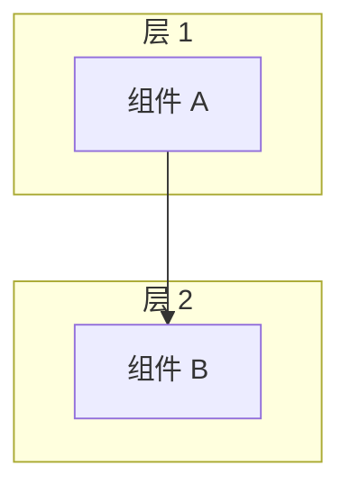
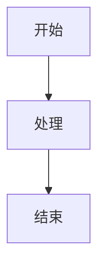
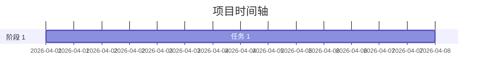
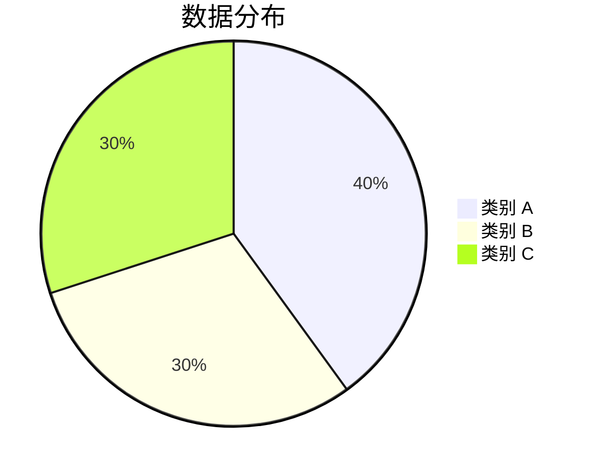

# 智能体工程文章写作标准流程

> **版本**: 1.0  
> **创建时间**: 2026-04-21  
> **适用范围**: 所有发布到 agent-engineering 仓库的文章

---

## 📋 流程概览

```
选题 → 写作 → 生成封面图 → 优化插图 → 优化联系方式 → 推送到 GitHub → 发布
```

**总耗时**：约 60-90 分钟/篇

---

## 🎯 标准流程

### Step 1: 选题与大纲（10 分钟）

**任务**：
- [ ] 确定文章主题
- [ ] 明确目标读者
- [ ] 编写文章大纲
- [ ] 预估阅读时间

**模板**：
```markdown
# 文章标题

## 📋 摘要
（100-200 字概括全文）

## 大纲
1. 引言/背景
2. 核心内容
3. 实战案例
4. 总结
5. 参考资料
```

---

### Step 2: 文章写作（30-60 分钟）

**任务**：
- [ ] 撰写完整文章
- [ ] 使用 Markdown 格式
- [ ] 添加代码示例
- [ ] 添加必要的 ASCII 图表

**要求**：
- ✅ 标题清晰（20-40 字）
- ✅ 摘要简洁（100-200 字）
- ✅ 结构清晰（使用 H1/H2/H3）
- ✅ 代码高亮（使用 ```language）
- ✅ 段落简短（每段<5 行）

**工具**：
- VS Code / Obsidian / Typora
- 语法检查：Grammarly / 秘塔写作猫

---

### Step 3: 生成封面图（10 分钟）

**工具**：`baoyu-cover-image` 或 `baoyu-image-gen`

**步骤**：
```bash
# 1. 创建提示词文件
cat > article-cover-prompt.md << 'EOF'
# 文章封面图提示词

## 文章信息
- 标题：{文章标题}
- 主题：{文章主题}
- 关键词：{3-5 个关键词}

## 设计要求
- 类型：conceptual（概念图）
- 配色：warm（科技蓝 + 紫色渐变）
- 渲染：flat-vector（扁平矢量）
- 文字：title-only
- 情绪：balanced
- 宽高比：16:9

## 视觉元素
- 元素 1：{与主题相关的视觉元素}
- 元素 2：{...}
- 元素 3：{...}
EOF

# 2. 生成封面图
bun ~/.openclaw/skills/baoyu-image-gen/scripts/main.ts \
  --promptfile article-cover-prompt.md \
  --image covers/article-cover.jpg \
  --ar 16:9 \
  --quality 2k
```

**要求**：
- ✅ 分辨率：1920x1080（16:9）
- ✅ 文件大小：<5MB
- ✅ 风格：科技感、简洁、专业
- ✅ 配色：科技蓝 + 紫色渐变

**备用方案**（如果 API 不可用）：
- 使用 Unsplash 免费图片
- 使用 Draw.io 绘制简洁封面
- 使用纯色背景 + 文字

---

### Step 4: 优化插图（15 分钟）

**工具**：Mermaid（首选）

**原则**：
- ✅ 能用 Mermaid 就不用图片
- ✅ 代码即文档，易于维护
- ✅ GitHub 原生支持，自动渲染

**常用图表类型**：

#### 1. 架构图


#### 2. 流程图


#### 3. 时间轴


#### 4. 数据图表


**检查清单**：
- [ ] 架构图：展示系统层次结构
- [ ] 流程图：展示关键流程
- [ ] 时间轴：展示实施时间（如适用）
- [ ] 数据图表：展示核心数据（如适用）

---

### Step 5: 优化联系方式（5 分钟）

**要求**：
- ✅ 删除独立的"联系我们"章节
- ✅ 整合进"关注我"部分
- ✅ 使用 GitHub 图床显示二维码
- ✅ 添加关注引导文字

**标准格式**：
```markdown
---

## 📱 关注我

**微信公众号**: 智能体开发

专注于分享：
- AI Agent 开发与自动化
- Harness Engineering 实战
- OpenClaw 技术应用
- 编程效率提升


> **👆 长按二维码，关注"智能体开发"**

*扫码关注，获取最新文章和技术干货*

---
```

**检查清单**：
- [ ] 二维码使用 GitHub 图床 URL
- [ ] 包含公众号名称
- [ ] 包含专注领域列表
- [ ] 包含关注引导文字
- [ ] 删除了独立的"联系我们"章节

---

### Step 6: 推送到 GitHub 仓库（10 分钟）

**仓库**：https://github.com/subaochen/agent-engineering

**目录结构**：
```
agent-engineering/
├── README.md
├── articles/
│   └── 02-article-slug/
│       └── article.md
└── assets/
    └── wechat-qr.jpg
```

**推送方式**：

#### 方式 A：秘书长协助推送（推荐）

**提供信息**：
1. 文章标题
2. 文章内容（Markdown 文件）
3. 封面图文件
4. 期望的文章分类

**秘书长执行**：
```bash
# 1. 创建文章目录
mkdir -p /tmp/agent-engineering/articles/02-article-slug

# 2. 复制文章和封面图
cp article.md /tmp/agent-engineering/articles/02-article-slug/
cp cover.jpg /tmp/agent-engineering/assets/

# 3. 更新 README（添加文章链接）
# 在文章目录部分添加新文章

# 4. 提交并推送
cd /tmp/agent-engineering
git add .
git commit -m "docs: 添加第 N 篇文章 - 文章标题"
git push
```

#### 方式 B：GitHub 在线编辑

1. 打开：https://github.com/subaochen/agent-engineering
2. 点击：`articles/` → `Add file` → `Create new file`
3. 输入文件名：`02-article-slug/article.md`
4. 粘贴文章内容
5. 点击：`Commit new file`

---

### Step 7: 发布与分享（10 分钟）

**发布渠道**：

#### 1. 朋友圈/微信群
```
📝 新文章发布：{文章标题}

GitHub 仓库：https://github.com/subaochen/agent-engineering

核心内容：
✅ {亮点 1}
✅ {亮点 2}
✅ {亮点 3}

适合人群：
- {目标读者 1}
- {目标读者 2}

欢迎 Star ⭐️ 支持！

#AI #Agent #智能体 #工程化
```

#### 2. 知乎
```
📝 新文章：{文章标题}

完整内容见 GitHub：
https://github.com/subaochen/agent-engineering

{文章摘要 200 字}

欢迎交流讨论！
```

#### 3. 掘金
```
📝 {文章标题}

本文已发布到 GitHub 仓库：
https://github.com/subaochen/agent-engineering

{文章摘要 200 字}

#AI #Agent #智能体
```

#### 4. 公众号
```
（使用公众号排版工具）
- 添加封面图
- 粘贴文章内容
- 添加二维码
- 设置定时发布
```

---

## 📊 质量检查清单

### 发布前检查

**内容质量**：
- [ ] 标题清晰（20-40 字）
- [ ] 摘要简洁（100-200 字）
- [ ] 结构清晰（H1/H2/H3 层次分明）
- [ ] 代码高亮（使用正确的 language）
- [ ] 段落简短（每段<5 行）
- [ ] 无错别字
- [ ] 无语法错误

**插图质量**：
- [ ] 封面图已生成（1920x1080）
- [ ] Mermaid 图表已添加（架构图/流程图等）
- [ ] 所有图表 GitHub 可正常渲染
- [ ] 无外部图片依赖

**联系方式**：
- [ ] "关注我"部分已添加
- [ ] 二维码使用 GitHub 图床
- [ ] 包含关注引导文字
- [ ] 删除了"联系我们"章节

**仓库结构**：
- [ ] 文章目录正确（articles/XX-slug/）
- [ ] README 已更新（添加文章链接）
- [ ] 封面图已上传（assets/）
- [ ] .gitignore 正确

---

## 🎯 时间分配

| 步骤 | 预计时间 | 占比 |
|------|----------|------|
| Step 1: 选题与大纲 | 10 分钟 | 11% |
| Step 2: 文章写作 | 30-60 分钟 | 33-67% |
| Step 3: 生成封面图 | 10 分钟 | 11% |
| Step 4: 优化插图 | 15 分钟 | 17% |
| Step 5: 优化联系方式 | 5 分钟 | 6% |
| Step 6: 推送到 GitHub | 10 分钟 | 11% |
| Step 7: 发布与分享 | 10 分钟 | 11% |
| **总计** | **90-120 分钟** | **100%** |

---

## 📈 持续优化

### 每篇文章后回顾

**记录**：
- 实际耗时 vs 预计耗时
- 遇到的问题
- 改进建议

**更新流程**：
- 每季度回顾一次
- 优化耗时的步骤
- 添加新的最佳实践

### 工具升级

**关注**：
- 新的 AI 写作工具
- 新的插图生成工具
- 新的发布工具

**评估**：
- 是否提升效率
- 是否提升质量
- 是否值得引入

---

## 📋 模板文件

### 文章模板

```markdown
# 文章标题

> **摘要**：100-200 字概括全文

---

## 📋 前言

（引出话题，说明写作背景）

---

## 正文

（使用 H2/H3 组织内容）

---

## 📊 总结

（总结全文，提炼核心观点）

---

## 📱 关注我

**微信公众号**: 智能体开发

专注于分享：
- AI Agent 开发与自动化
- Harness Engineering 实战
- OpenClaw 技术应用
- 编程效率提升


> **👆 长按二维码，关注"智能体开发"**

*扫码关注，获取最新文章和技术干货*

---
```

### 封面图提示词模板

```markdown
# 文章封面图提示词

## 文章信息
- 标题：{文章标题}
- 主题：{文章主题}
- 关键词：{3-5 个关键词}

## 设计要求
- 类型：conceptual（概念图）
- 配色：warm（科技蓝 + 紫色渐变）
- 渲染：flat-vector（扁平矢量）
- 文字：title-only
- 情绪：balanced
- 宽高比：16:9

## 视觉元素
- 元素 1：{与主题相关的视觉元素}
- 元素 2：{...}
- 元素 3：{...}
```

---

## 🔗 相关资源

### 工具文档
- baoyu-image-gen: `~/.openclaw/skills/baoyu-image-gen/SKILL.md`
- baoyu-cover-image: `~/.openclaw/skills/baoyu-cover-image/SKILL.md`

### 参考文章
- 第一篇文章：https://github.com/subaochen/agent-engineering
- Harness Engineering 实施指南

### 学习资源
- Mermaid 官方文档：https://mermaid.js.org/
- GitHub 文档：https://docs.github.com/

---

*最后更新：2026-04-21*  
*维护者：秘书长 AI 团队*  
*版本：1.0*
